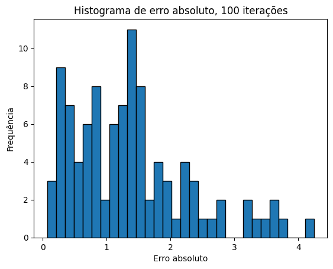
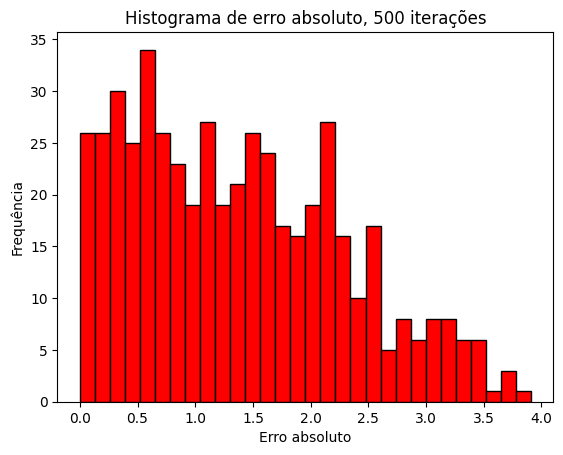
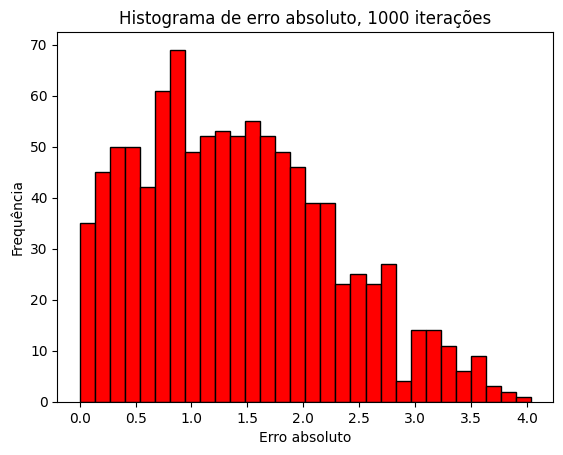

# Desafio Netflix - Sistema de Recomendação

Este projeto consiste na construção de um sistema de recomendação que prevê a avaliação de filmes por usuários com base em técnicas de decomposição de matriz. A abordagem usada auxilia na personalização da experiência de recomendação para diferentes perfis de usuários.

## Estrutura do Projeto

1. **Preparação dos Dados**:
   - Carregamento e visualização do conjunto de dados `ratings_small.csv`.
   - Remoção de colunas desnecessárias e preparação dos dados para análise.

2. **Construção da Matriz de Usuários e Filmes**:
   - Criação de uma matriz de notas `A`, onde cada linha representa um usuário (`userId`), cada coluna um filme (`movieId`), e os valores contêm as notas atribuídas pelos usuários.
   
3. **Decomposição de Matriz**:
   - Implementação de técnicas para fatorar a matriz `A`, visando estimar notas faltantes e prever avaliações futuras.
   
4. **Avaliação e Validação do Modelo**:
   - Avaliação da precisão das previsões realizadas pelo modelo com métricas como RMSE (Root Mean Square Error).

## Gráficos de Erro

### 100 Iterações

### 500 Iterações

### 1000 Iterações

